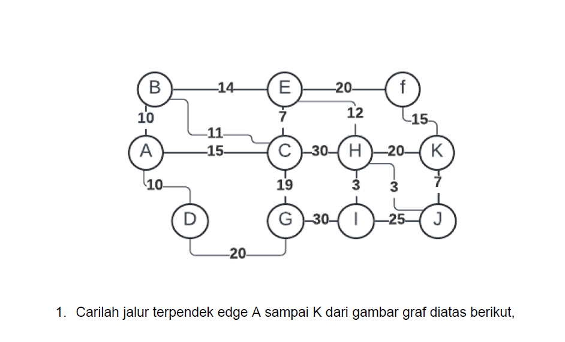
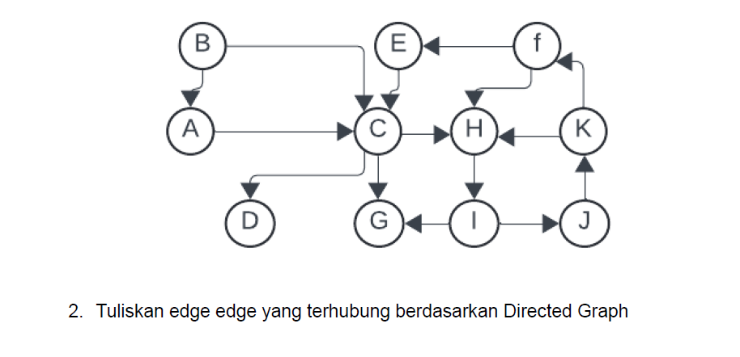

# Jawaban

Jarak terdekat dari titik A menuju titik K yaitu:

1. >`A → C → E → H → J → K`

    

# Jawaban

Berikut edge edge yang terhubung berdasarkan Directed Graph diatas:

1. >`Vertex : A, B, C, D, E, F, G, J, ,I, J, K `

2. > `Edge : `
        
        1.  <A, C>
        2.  <B, A>
        3.  <B, C>
        4.  <C, D>
        5.  <C, G>
        6.  <C, H>
        7.  <E, C>
        8.  <F, E>
        9.  <F, H>
        10. <H, I>
        11. <I, J>
        12. <I, G>
        13. <J, K>
        14. <K, F>
        15. <K, H>